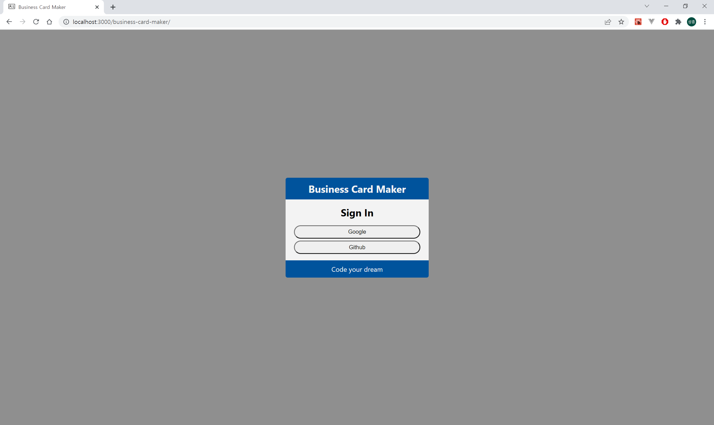
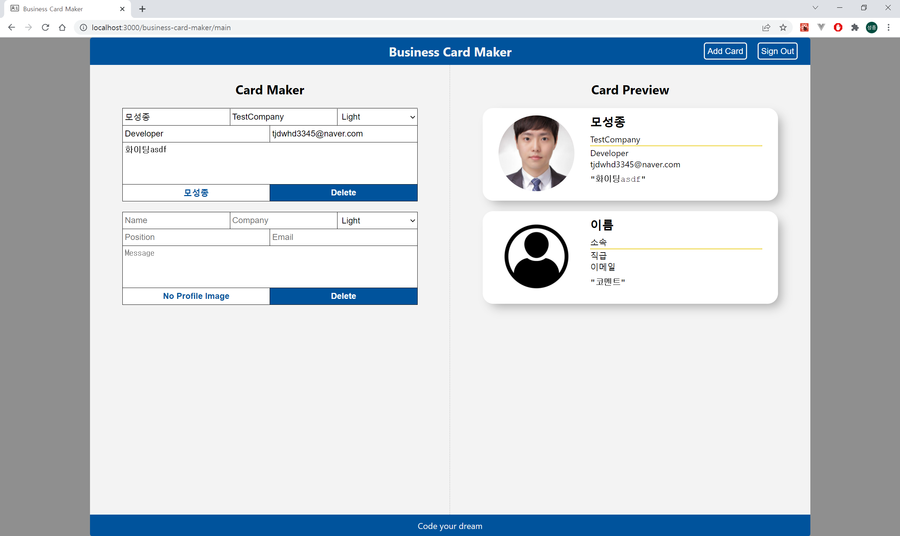
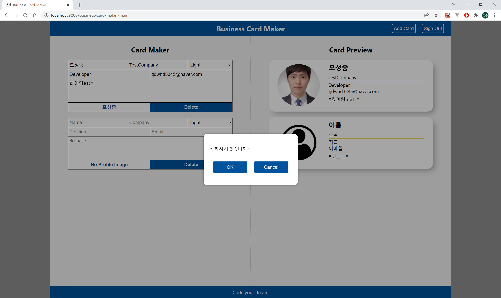
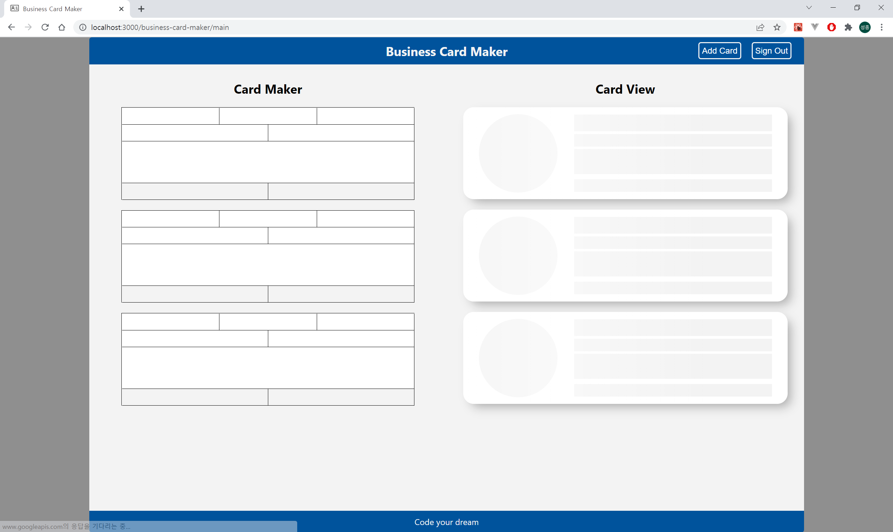
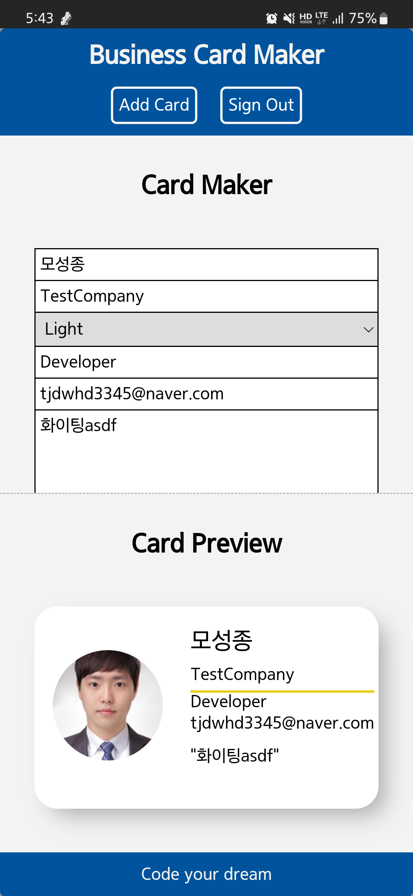
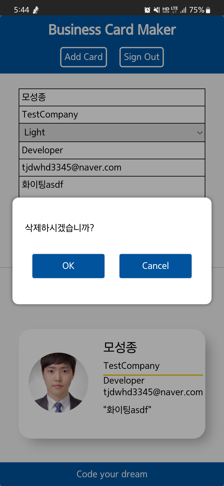
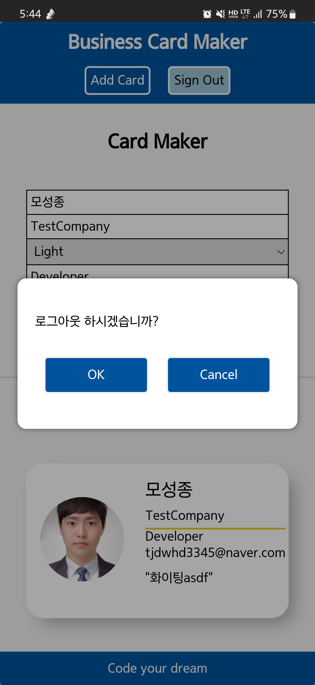
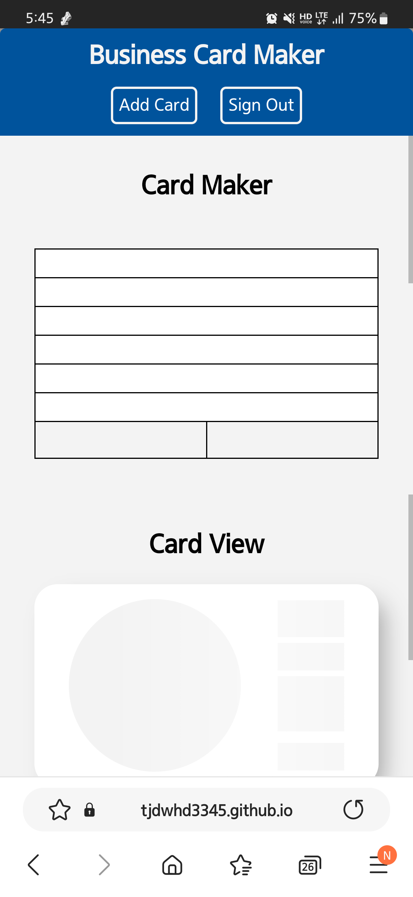

# Business Card Maker

https://tjdwhd3345.github.io/business-card-maker/

인물정보를 등록해 관리하는 카드리스트 서비스

1. React
2. Firebase (v9)
3. Cloudinary

## 기능

1. Firebase 의 사용자 인증 로그인, 실시간 DB 연동
2. React Portal 사용하여 Modal 팝업 구현
3. Cloudinary를 사용하여 사용자 이미지 업로드 가능
4. Skeleton UI 적용

## 실행화면

### Desktop

### Mobile

